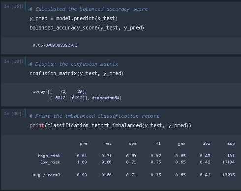
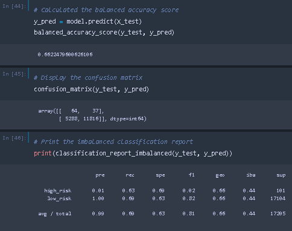
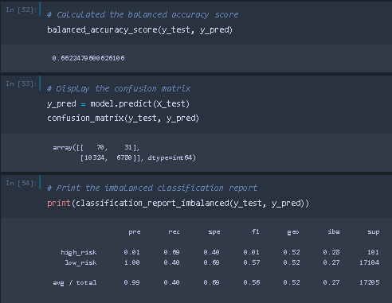
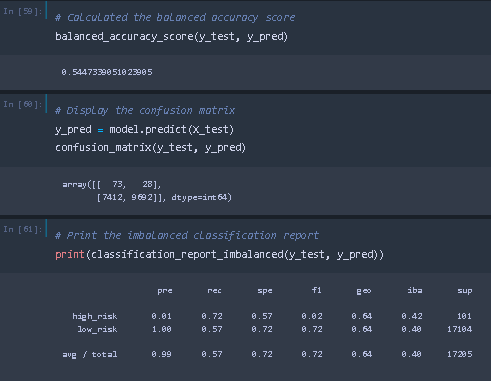
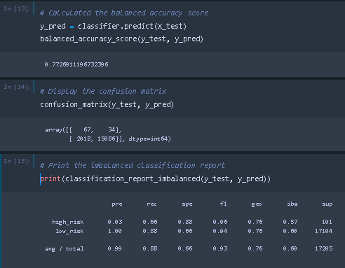
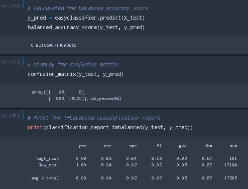

# Credit Risk Analysis
## OVERVIEW
The purpose of this analysis is to build and evaluate resampling models to predict credit risk.

Algorithms used:
- RandomOverSampler
- SMOTE
- ClusterCentroids
- SMOTEENN
- BalancedRandomForestClassifier
- EasyEnsembleClassifier

## RESULTS
- ### RandomOverSampler

- ### SMOTE

- ### ClusterCentroids

- ### SMOTEENN

- ### BalancedRandomForestClassifier

- ### EasyEnsembleClassifier

## SUMMARY
The EasyEnsembleClassifier had the best balanced accuracy at 93.2% and SMOTEEN had the worst balanced accuracy at 54.5%. The EasyEnsembleClassifier also had the best sensitivity for both high risk and low risk groups at .92 and .94 respectively.  SMOTE had the worst sensitivity for high risk at .63 and ClusterCentroids has the worst sensitivity for low risk at .40.  Although EasyEnsembleClassifier score well in the earlier two categories, its precision for the high risk group is only .09, which is the highest high risk precision of all the options but still extremely low.  It would not work well to accurately identify high risk loan applicants.  
### Recommendations
None of the options explored appear to be good options for identifying high risk loan applicants.  Additional work to make the options stronger would be needed in order to possibly be able to effectively use any of the models. 